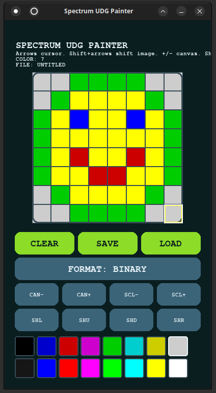

# ZX-Spectrum-like-UDG-Painter

Pixel/UDG painter in Pygame with a ZX Spectrum-inspired interface.

## Visual example



## Run

```bash
python3 udg_painter.py
```

Optional for ICO load/save:

```bash
pip install pillow
```

## Main controls

Keyboard:

- Arrow keys: move the cursor.
- Shift + arrow keys: shift the whole image with wraparound.
- Space: toggle pixel under cursor.
- 0..7: select normal Spectrum colour.
- Shift + 0..7: select bright Spectrum colour.
- "+"/"-": increase/decrease canvas size.
- Shift+"+" / Shift+"-": scale image from stable reference.
- S: save.
- L: load.
- M: change save format.
- C: clear.
- Esc: quit.

Touch/mouse buttons:

- CLEAR, SAVE, LOAD.
- FORMAT.
- CAN-/CAN+: resize canvas without scaling image.
- SCL-/SCL+: scale image.
- SHL/SHR/SHU/SHD: shift image left/right/up/down with wraparound.

## Save/load behaviour

The editor now remembers the file being edited. When you load or save a file, subsequent saves use the same directory and filename instead of always using `graphic`.

Supported formats:

- `.udg`: color matrix.
- `.bin`: binary rows.
- `.xpm`: XPM image.
- `.ico`: icon image.

The save dialog includes a directory browser and asks for confirmation before overwriting an existing file.


<p align=center><b>- oOo -</b></p>

